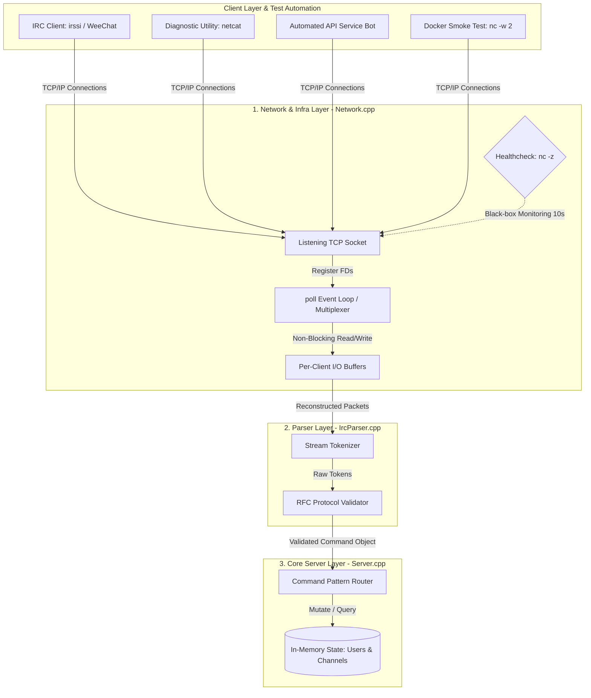

# 💬 Ft_irc — High-Concurrency IRC Server

A fully functional, RFC-compliant Internet Relay Chat (IRC) server written in **C++98**. This project implements a robust network infrastructure capable of handling multiple concurrent clients communicating in real-time through isolated channels and private messages, without thread exhaustion.

---

### Engineering & Architecture Challenges

To align with SRE and high-performance backend standards, the implementation prioritizes non-blocking operations, predictable resource allocation, and strict protocol enforcement.

#### System Architecture Diagram



#### 1. Concurrency Model & I/O Multiplexing
Instead of spawning a thread per connection (which scales poorly and risks context-switching overhead), the entire server operates on a **single-threaded event loop** utilizing the **`poll()` system call**.
- **Non-Blocking Sockets:** All client sockets and the main listening socket are configured to be non-blocking (`O_NONBLOCK`). This prevents a slow or malicious client from hanging the entire server during a read/write operation.
- **Dynamic Message Buffering:** Network streaming can fragment packets. The server implements an accumulation buffer per client, ensuring complete IRC commands (delimited by `\n`) are reconstructed before passing them to the parser layer.

#### 2. Clean Architecture & Software Patterns
The codebase is decoupled into three distinct architectural layers to maximize maintainability and separate concerns:
- **Network Layer (`Network.cpp`):** Manages the low-level socket lifecycle, executes `poll()`, handles incoming connections, and flushes I/O buffers.
- **Parser Layer (`IrcParser.cpp`):** Validates raw text packets against RFC specifications and translates them into structured internal command objects.
- **Server/Logic Layer (`Server.cpp`):** Maintains the global state of the application (in-memory maps of clients and channels) and routes requests using the **Command Pattern**.

#### 3. Robustness & Memory Management (SRE Focus)
Developing in C++98 meant working without modern smart pointers (`std::unique_ptr`, `std::shared_ptr`). 
- **Zero Memory Leaks:** Every dynamic allocation (clients, channels, custom bot state) is strictly tracked. 
- **Graceful Shutdown:** Implemented clean signal interception (`SIGINT` / `SIGTERM`) to trigger a controlled teardown sequence. When the server stops, it gracefully disconnects all active sockets, flushes logs, and frees 100% of allocated memory (validated via Valgrind).

#### 4. Containerization & Test Automation (DevOps Engine)
The production-ready deployment is fully orchestrated using **Docker** and **Docker Compose**, ensuring isolation and environmental consistency:
- **Multi-Stage Builds:** The application compiles inside an isolated builder stage and runs within a minimal `debian:bookworm-slim` image, reducing overall container size and security vulnerability surfaces.
- **Black-Box Health Monitoring:** Built-in active `healthcheck` that pings the server's TCP socket every 10 seconds via `nc -z` to ensure system responsiveness.
- **Automated Integration Testing:** Includes a dedicated ephemeral smoke-test client service (`irc-client`) that automatically verifies connection handshakes, ensures POSIX shell stream parsing compatibility, and safely self-terminates via timeout flags (`nc -w 2`) with an `exit code 0`.

---

### Key Features & RFC Compliance

The server fully implements core functionalities from **RFC 1459** and **RFC 2812**:

- **Authentication & Security:** Robust client registration flow requiring password verification (`PASS`), nickname selection (`NICK`), and user handshake (`USER`).
- **Advanced Channel Management:** Automated creation/destruction of rooms, channel operator privileges, and dynamic channel modes:
  - Invite-only (`+i`) & Invitation routing (`INVITE`).
  - Topic restrictions (`+t`) & Topic alteration (`TOPIC`).
  - Password-protected channels (`+k`).
  - Strict user limits (`+l`) to prevent resource exhaustion.
- **Private Messaging:** Real-time data routing (`PRIVMSG`) between individual users and full channels.
- **Automated API Bot:** Includes a separate, fully containerizable IRC bot executable that joins channels and interfaces with external network APIs (such as `wttr.in` via `curl`) to serve real-time weather metrics, system time, and service diagnostics.

---

### Tech Stack & Core Competencies

- **Language:** C++98 (Strict standard compliance)
- **Containerization & Orchestration:** Docker, Docker Compose
- **Scripting & Tooling:** POSIX Shell Scripting, GNU Make, GCC / Clang
- **Environment:** Unix-like Operating Systems (Linux, WSL, macOS)
- **Concepts Applied:** Sockets (TCP/IP), File Descriptor Multiplexing (`poll`), Non-blocking I/O, Black-box Monitoring, Environment Decoupling, Smoke Testing.

---

### Compilation & Execution

For detailed environment setup, variable configuration (`.env`), and deep troubleshooting, check out our comprehensive [Docs: Usage & Infrastructure Guide](./docs/Usage.md).

#### Option A: Containerized Deployment (Recommended)
1. Create a `.env` file in the root directory:
   ```env
   IRC_PORT=6667
   IRC_PASSWORD=mySecretPassword
   ```
2. Build and launch the cluster with one command:
   ```bash
   docker compose up
   ```
3. Destroy the network and containers when finished:
   ```bash
   docker compose down
   ```

#### Option B: Local Compilation
To build the high-concurrency server executable (`ircserv`):
```bash
make
```
To compile the standalone automated service bot (`ircbot`):
```bash
make bonus
```
Run the server locally:
```bash
./ircserv <port> <password>
# Example: ./ircserv 6667 mySecretPassword
```

---

### Authors & Collaboration
Developed as a collaborative engineering project by:
- **Daniel Nogueras** ([danoguer](https://github.com/danoguer))
- **Andrés Fernández** ([andfern2](https://github.com/andfern2))
  
