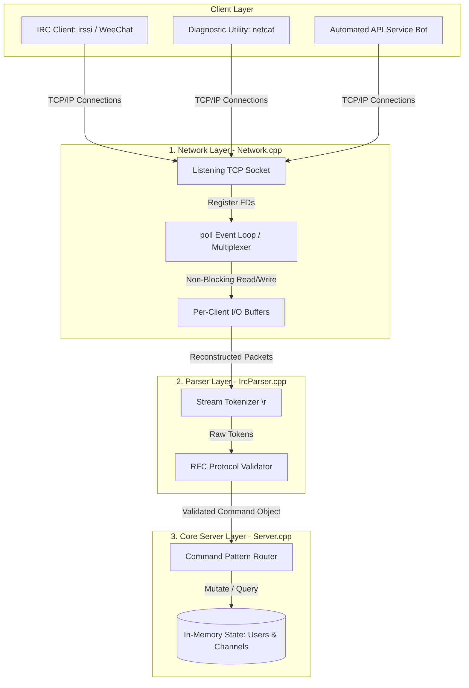

# 💬 Ft_irc — High-Concurrency IRC Server

A fully functional, RFC-compliant Internet Relay Chat (IRC) server written in **C++98**. This project implements a robust network infrastructure capable of handling multiple concurrent clients communicating in real-time through isolated channels and private messages, without thread exhaustion.

---

### Engineering & Architecture Challenges

To align with SRE and high-performance backend standards, the implementation prioritizes non-blocking operations, predictable resource allocation, and strict protocol enforcement.

#### System Architecture Diagram



#### 1. Concurrency Model & I/O Multiplexing
Instead of spawning a thread per connection (which scales poorly and risks context-switching overhead), the entire server operates on a **single-threaded event loop** utilizing the **`poll()` system call**.
- **Non-Blocking Sockets:** All client sockets and the main listening socket are configured to be non-blocking (`O_NONBLOCK`). This prevents a slow or malicious client from hanging the entire server during a read/write operation.
- **Dynamic Message Buffering:** Network streaming can fragment packets. The server implements an accumulation buffer per client, ensuring complete IRC commands (delimited by `\r\n`) are reconstructed before passing them to the parser layer.

#### 2. Clean Architecture & Software Patterns
The codebase is decoupled into three distinct architectural layers to maximize maintainability and separate concerns:
- **Network Layer (`Network.cpp`):** Manages the low-level socket lifecycle, executes `poll()`, handles incoming connections, and flushes I/O buffers.
- **Parser Layer (`IrcParser.cpp`):** Validates raw text packets against RFC specifications and translates them into structured internal command objects.
- **Server/Logic Layer (`Server.cpp`):** Maintains the global state of the application (in-memory maps of clients and channels) and routes requests using the **Command Pattern**.

#### 3. Robustness & Memory Management (SRE Focus)
Developing in C++98 meant working without modern smart pointers (`std::unique_ptr`, `std::shared_ptr`). 
- **Zero Memory Leaks:** Every dynamic allocation (clients, channels, custom bot state) is strictly tracked. 
- **Graceful Shutdown:** Implemented clean signal interception (`SIGINT` / `SIGTERM`) to trigger a controlled teardown sequence. When the server stops, it gracefully disconnects all active sockets, flushes logs, and frees 100% of allocated memory (validated via Valgrind).

---

### Key Features & RFC Compliance

The server fully implements core functionalities from **RFC 1459** and **RFC 2812**:

- **Authentication & Security:** Robust client registration flow requiring password verification (`PASS`), nickname selection (`NICK`), and user handshake (`USER`).
- **Advanced Channel Management:** Automated creation/destruction of rooms, channel operator privileges, and dynamic channel modes:
  - Invite-only (`+i`) & Invitation routing (`INVITE`).
  - Topic restrictions (`+t`) & Topic alteration (`TOPIC`).
  - Password-protected channels (`+k`).
  - Strict user limits (`+l`) to prevent resource exhaustion.
- **Private Messaging:** Real-time data routing (`PRIVMSG`) between individual users and full channels.
- **Automated API Bot:** Includes a separate, fully containerizable IRC bot executable that joins channels and interfaces with external network APIs (such as `wttr.in` via `curl`) to serve real-time weather metrics, system time, and service diagnostics.

---

### Tech Stack & Core Competencies

- **Language:** C++98 (Strict standard compliance)
- **Tooling:** GNU Make, GCC / Clang compiler
- **Environment:** Unix-like Operating Systems (Linux, macOS, WSL)
- **Concepts Applied:** Sockets (TCP/IP), File Descriptor Multiplexing, Non-blocking I/O, Signal Handling, String Parsing State Machines.

---

### File Structure

```text
ft_irc/
├── src/
│   ├── main.cpp                 # Application entry point
│   ├── core/                    # Infrastructure & Network engine
│   │   ├── Server.cpp/hpp       # State tracking and execution
│   │   ├── Network.cpp/hpp      # Low-level poll() implementation
│   │   └── IrcParser.cpp/hpp    # Stream parsing and sanitization
│   ├── commands/                # Encapsulated Command Pattern handlers
│   │   ├── Pass.cpp | Nick.cpp | User.cpp  # Authentication
│   │   ├── Join.cpp | Part.cpp | Mode.cpp  # Channel Operations
│   │   └── PRIVMSG.cpp | Kick.cpp | Quit.cpp # Interaction & Teardown
│   └── bonus/
│       └── Bot.cpp/hpp          # External API Bot implementation
└── Makefile
```

---

### Compilation & Execution

#### Compilation
To build the high-concurrency server executable (`ircserv`):
```bash
make
```
To compile the standalone automated service bot (`ircbot`):
```bash
make bonus
```

#### Running the Server
```bash
./ircserv <port> <password>
# Example: ./ircserv 6667 mySecretPassword
```

#### Connecting Clients
The server is compatible with any standard IRC client software (`irssi`, `WeeChat`, `mIRC`) or raw network utilities for SRE diagnostics like `netcat`:
```bash
nc localhost 6667
```

---

### Authors & Collaboration
Developed as a collaborative engineering project by:
- **Daniel Nogueras** ([danoguer](https://github.com/danoguer))
- **Andrés Fernández** ([andfern2](https://github.com/andfern2))
```
