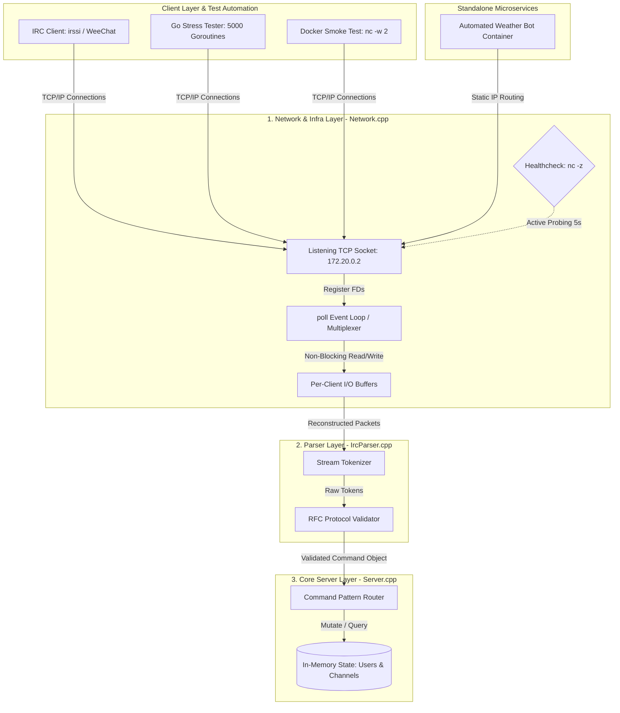

# 💬 IRC-Server

A functional Internet Relay Chat (IRC) server written in **C++98**. Developed as part of the 42 school curriculum, this project implements a network infrastructure designed to handle concurrent client communication in real time using a single-threaded architecture, without thread exhaustion or resource leaks.

---

### Engineering & Architectural Constraints

The implementation prioritizes non-blocking operations, predictable resource allocation, and strict protocol enforcement under low-level standard constraints.

#### ⚠️ Academic Constraints & C++98 Context
This project strictly enforces the **C++98 standard**. The primary objective is to demonstrate manual memory management, low-level socket programming, and systems-level architecture without relying on modern language features (`std::unique_ptr`, `std::shared_ptr`, or C++11 memory models). Every data structure, reference, and pointer allocation is manually tracked and audited.

#### System Architecture & Infrastructure Diagram



#### 1. Concurrency Model & I/O Multiplexing
To avoid the thread-context switching overhead and scale limitations of a thread-per-connection model, the entire server runs on a **single-threaded event loop** using the **`poll()` system call**.
- **Non-Blocking Sockets:** All client sockets and the master listening socket are explicitly set to non-blocking mode (`O_NONBLOCK`). This guarantees that a slow or stalled client cannot block the execution loop during I/O operations.
- **Dynamic Message Buffering:** Network streaming can fragment TCP packets. The server associates an independent read/write buffer with each client, ensuring complete IRC commands (delimited by `\n` or `\r\n`) are fully reconstructed before passing them to the parser layer.

#### 2. Load Benchmarking & Resource Limits
The architecture was audited using a custom benchmarking utility written in **Go** to measure behavior up to the operating system boundaries:

* **Simulated Workload:** 5,000 concurrent Goroutines executing rapid TCP connections and command bursts.
* **Measured Capacity:** **4,090 active simultaneous connections with 0.00% packet loss.**
* **Tolerant Failure Handling:** Upon reaching the physical ceiling of **4,096 open File Descriptors** (enforced via container `ulimits`), the server gracefully rejected subsequent attachments (910 dropped) via `accept()` while maintaining the stability and data streams of the 4,090 already connected active clients.

#### 3. Software Patterns & Architecture
The codebase is structured into three decoupled layers:
- **Network Layer (`Network.cpp`):** Handles socket lifecycles, runs the `poll()` multiplexing loop, accepts connections, and manages raw byte I/O buffers.
- **Parser Layer (`IrcParser.cpp`):** Tokenizes raw text streams and validates incoming syntax against RFC specifications, generating internal command structures.
- **Server/Logic Layer (`Server.cpp`):** Manages global state (in-memory maps tracking users and channels) and executes actions using the **Command Pattern**.
- **Memory Lifetime:** Clean signal interception (`SIGINT` / `SIGTERM`) invokes a controlled teardown sequence, disconnecting sockets and releasing 100% of dynamically allocated memory (verified via Valgrind).

#### 4. Containerization & Isolation
The deployment is orchestrated using **Docker** and **Docker Compose** to guarantee environment consistency:
- **Multi-Stage Builds:** The build stage compiles the binaries inside an isolated compiler environment. The final runtime layer copies only the compiled executables into a minimal `debian:bookworm-slim` image, reducing attack surfaces.
- **Least Privilege Security:** Containers drop root privileges immediately after setup, executing the runtime processes under a unprivileged user (`USER ircuser`).
- **Static Networking:** Configures a dedicated virtual bridge network (`172.20.0.0/16`) with static IP anchoring (`172.20.0.2` for the server) to satisfy low-level C network function address conversion (`inet_addr`).
- **Health Probing:** Integrates a native container `healthcheck` that probes the TCP port every 5 seconds using `nc -z`. The bot service container deployment is gated via `condition: service_healthy`, preventing race conditions during startup.

---

### Protocol Implementation & Key Features

The server implements core features from **RFC 1459** and **RFC 2812**:

- **Authentication:** Client registration pipeline processing password verification (`PASS`), nickname assignment (`NICK`), and user handshake (`USER`).
- **Channel Operations:** Dynamic creation and destruction of rooms, channel operator tracking, and standard channel modes (`+i` invite-only, `+t` topic restrictions, `+k` channel key, `+l` user limits).
- **Data Routing:** Direct private messaging and channel-wide broadcasting using the `PRIVMSG` command.

#### Standalone Automated Bot
Includes a separate client executable that operates in an independent container, attaches via the internal bridge network, and processes data requests (such as `wttr.in` text-based weather lookups) for active channels.

---

### Tech Stack & Competencies

- **Core System:** C++98 (Strict standard enforcement)
- **Tooling & Orchestration:** Docker, Docker Compose, GNU Make, GCC / Clang
- **Testing Utilities:** Go (Golang) concurrency stress testing tools, Netcat (`nc`)
- **Key Competencies:** TCP/IP Socket Programming, File Descriptor Multiplexing (`poll`), Non-blocking I/O, Private Container Networking, System Resource Tuning (`ulimits`), Health Monitoring.

---

### Execution & Deployment

For deep-dive configuration details and environment variables, refer to the [Docs: Usage & Infrastructure Guide](./docs/Usage.md).

#### Option A: Docker Compose Deployment (Recommended)
1. Configure the `.env` file in the root directory:
   ```env
   IRC_PORT=6667
   IRC_PASSWORD=mySecretPassword
   ```
2. Build and start the containers:
   ```bash
   docker compose up --build
   ```
3. Stop and remove containers and networks:
   ```bash
   docker compose down --volumes
   ```

#### Option B: Local Compilation
Build the server binary (`ircserv`):
```bash
make
```
Build the bot binary (`ircbot`):
```bash
make bonus
```
Execute the server:
```bash
./ircserv <port> <password>
```

---

### Authors
- **Daniel Nogueras** ([danoguer](https://github.com/danoguer))
- **Andrés Fernández** ([andfern2](https://github.com/andfern2))
